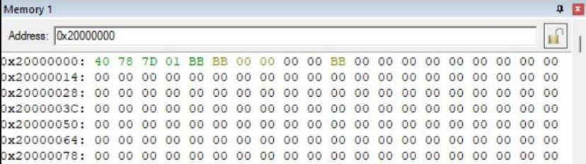
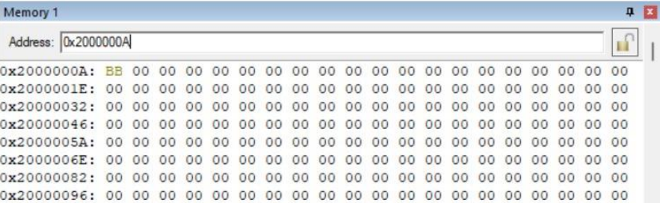

## Problem
Find the number BB inside address from location `0x20000000` until `0x20000008` and move it to new address started at `0x2000000A`.

1. Flowchart and explanation
2. Code explanation
3. Debugging explanation

### Code (Keil uVision5)

```c
AREA  assignment1, CODE, READONLY
    EXPORT  __main
    ENTRY
	
__main
		MOVW R0, #0x0000
		MOVT R0, #0x2000 ;Set R0 as pointer for 0x20000000_OLD LOCATION
		MOVW R1, #0x000A
		MOVT R1, #0x2000 ;Set R1 as pointer for 0x2000000A_NEW LOCATION
		MOVW R4, #0x0004
		MOVT R4, #0x2000 ;Set R4 as pointer for 0x20000004 to store the next value 0xBBBB
		MOV  R6, #0xBBBB 

		STR R6, [R4] 	 ;Store data in R6 at starting pointer 0x20000004
		LDRB R3, MyData   ;Insert input value BB to R3 
MyData	DCB	0xBB 

		
loop	CMP R8, R3	     ;Compare the input value in R3 and data in R8
		BEQ next1		 ;If R8 = R3 go to next1		
		LDRB R8,[R0], #1 ;Load the counter value from data in R0 to the R8		
		B loop			 ;Is the counter = BB?			
		
next1 	STRB R8, [R1]	 ;Store the data in R8 to the new location
		

stop	B	stop

		END
```

### Code Explanation
Based on our understanding of the given question, we need to insert any value that has BB inside the memory address and compare each of the data with the inserted input value that we use. If the value is the same, we need to move it to a new address location. Otherwise, it will update the next value in the memory address location until the desired result is achieved.

To get this result, we use R0 as a pointer for an initial location, which is 0x20000000 until 0x20000008, and we use R1 (0x20000000A) as a pointer for our new location. We use R4 as a pointer for 0x200000004 to store the other data which is inside R6. Inside R6, the immediate value that we use is #0xBBBB, and we use the store instruction to store the value. So, by using this method, we can move the data within the targeted address location in the processor.

In line 19 and 20 from figure 1, we load our input value, which is 0xBB, to R3 by using the predefined MyData instruction because we want to compare this input value with data inside the memory address location within the range 0x20000000 - 0x20000008. By using the predefined MyData, we can load the data from memory because we want the data inside R3.

In line 25 from figure 1, we load the value in R0 as a counter and load the counted value to R8 to make a comparison between the value inside R3 and R8. The load instruction with the byte representation needs to be used to load the data from memory address R0 to the R8, and the immediate value is #1 because we want to update the effective address value as a counter until the desired result is achieved. So, by using the post-indexed addressing modes, we can make a comparison between the R8 and R3.

At line 24 and 26 from figure 1, after the loaded value is updated at R8, the CMP instruction will compare the value inside R8 and R3. If the value R8 = R3, the BEQ instruction will be executed and read the next1 label, and it will proceed to the next line, which is line 28. Since the value from memory address R0 to the core R8 has been moved from memory to register, we need to move the updated value in core R8 to the new memory address location, which is pointed at 0x20000000A. But if the value in R8 is not the same as R3, the BEQ instruction line will not be executed, and it will update the next value in the data. Then it will execute the B (Unconditional) instruction at line 26 and read the loop label and make a comparison again.

So, by using the conditions for branches, which are the BEQ and B, we can make any decision based on our desired result. When the BEQ is executed, the flag in core xPSR will update the Z value equal to 1 because it detects the same value. But if the value in R8 and R3 is not the same, it will set the N flag.

## 3. Debugging explanation

- For the data and code that we have design above, we need to save, build and the debugging the coding.
- Then, after we are debugging, we obtained the data in memory windows. After that, we do the step process to find our objective which is to find number BB in `0x20000000` until `0x20000008` as shown in figure below:

  

  
Figure 1: Data that obtained after debugging the codes in Memory 1


- For the last figure, shown about the register and value that appeared in Core.
- The value in R3 is compared to R8 in which when the both value are the same, the data in R8 will be store to the new location pointed at R1.
- As we can see that the value number BB in Register R3 and Register R8 move to the new address which is started in `0x2000000A` which is R1.
- We also can see that the value of SP in Register R13 which is `0x20000408`, the value of LR in Register R14 equal to `0x000003C5`, the value of PC in Register R15 which is = `0x0000042A` and lastly is `0x61000000` as known as the value of xPSR.

## Gif Presentation
